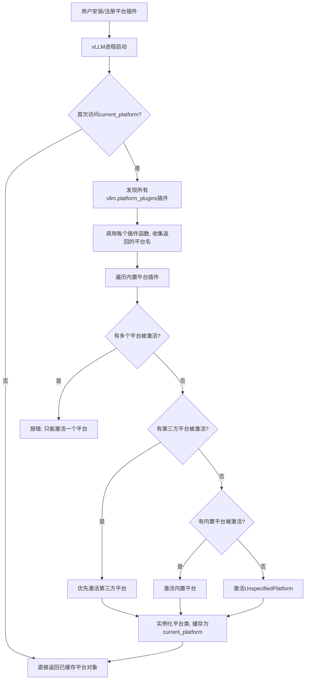

# vLLM 平台发现和解析前后流程

本文档详细介绍 vLLM 平台插件的发现与解析机制，结合源码和流程图说明前后各阶段的关键步骤。

---

## 1. 发现和解析前

### 1.1 平台插件注册

- 第三方平台插件需在其 `setup.py` 中注册 entry point，组名为 `vllm.platform_plugins`，如：
  ```python
  setup(
      name='vllm_ascend',
      ...
      entry_points={
          'vllm.platform_plugins': [
              "ascend = vllm_ascend:register"
          ]
      }
  )
  ```
- 插件函数（如 `ascend`）返回平台类的完全限定名（如 `"vllm_ascend.platform.NPUPlatform"`），可以。

### 1.2 vLLM 启动与插件可见性

- 用户已安装第三方平台插件包（如 `pip install vllm_ascend`）。
- vLLM 进程启动时，所有通过 entry_points 注册的插件都已在 Python 环境中可见。

---

## 2. 平台发现和解析流程

### 2.1 触发时机

- 只有在首次访问 `vllm.platforms.current_platform` 时，才会触发平台的发现和解析（**延迟初始化**）。
- 相关代码在 `vllm/platforms/__init__.py` 的 `__getattr__` 方法：

  ```python
  def __getattr__(name: str):
      if name == 'current_platform':
          global _current_platform
          if _current_platform is None:
              platform_cls_qualname = resolve_current_platform_cls_qualname()
              _current_platform = resolve_obj_by_qualname(platform_cls_qualname)()
              ...
          return _current_platform
      ...
  ```

### 2.2 平台插件的发现

- 调用 `resolve_current_platform_cls_qualname()`，其内部会：
  1. 调用 `load_plugins_by_group('vllm.platform_plugins')`，发现所有注册到该组的插件。
  2. 依次调用每个插件函数，收集返回非 `None` 的平台名。
- 同时，vLLM 还会遍历内置平台插件（如 cuda、cpu、rocm 等）。

### 2.3 平台解析与冲突处理

- 统计所有**被激活**的平台（即插件函数返回非 `None` 的平台）。
- 优先级：
  1. **第三方平台插件**优先于内置平台插件。
  2. 只允许有一个平台被激活，否则报错。
  3. 如果没有任何平台被激活，则使用 `UnspecifiedPlatform`。

  相关代码片段（`vllm/platforms/__init__.py`）：
  ```python
  if len(activated_oot_plugins) >= 2:
      raise RuntimeError("Only one platform plugin can be activated...")
  elif len(activated_oot_plugins) == 1:
      platform_cls_qualname = platform_plugins[activated_oot_plugins[0]]()
      ...
  elif len(activated_builtin_plugins) >= 2:
      raise RuntimeError("Only one platform plugin can be activated...")
  elif len(activated_builtin_plugins) == 1:
      platform_cls_qualname = builtin_platform_plugins[activated_builtin_plugins[0]]()
      ...
  else:
      platform_cls_qualname = "vllm.platforms.interface.UnspecifiedPlatform"
  ```

### 2.4 平台类实例化

- 通过 `resolve_obj_by_qualname(platform_cls_qualname)()` 实例化平台类，赋值给 `current_platform`。

---

## 3. 发现和解析后

- 之后所有对 `vllm.platforms.current_platform` 的访问，都会直接返回已实例化的平台对象。
- vLLM 的各个子系统（如模型加载、推理、分布式通信等）会根据 `current_platform` 的类型和属性，采用不同的实现和优化策略。

---

## 4. 流程图



---

## 5. 关键源码文件

- 插件注册：第三方包的 `setup.py`
- 插件发现与加载：`vllm/plugins/__init__.py` (`load_plugins_by_group`)
- 平台发现与解析：`vllm/platforms/__init__.py` (`resolve_current_platform_cls_qualname`, `__getattr__`)
- 平台基类接口：`vllm/platforms/interface.py`

---
